# Used Projects

- [rime-ice](https://github.com/iDvel/rime-ice)
- [rime-japanese](https://github.com/gkovacs/rime-japanese)
- [rime-spanish](https://github.com/gkovacs/rime-spanish)
- [latex-symbols](https://github.com/wklchris/Rime-latex-symbols) # 修改适配rime-ice

# 中英文混合输入方案
- [rime-melt](https://github.com/tumuyan/rime-melt)

# Rime 定制方案
- [weasel_style.yaml](https://github.com/rime/weasel/wiki)

## 主要文件和作用

修改或添加内容对文件时，依照以下说明放置到对应文件：

- `cn_dicts/`：中文词库文件。
  - `8105`：常用汉字单字。
  - `41448`：大字表，默认不启用，主要收录生僻字。
  - `base`：核心词库，包含两字词和常用词，必须包含注音和词频。两字词必须放到这个文件中。
  - `ext`：扩展词库，必须包含注音和词频。含有多音字的词条必须放到这个文件中。
  - `tencent`：大词库。必须没有注音。词频可选。脚本会自动补充。禁止包含多音字。
- `en_dicts/*.yaml`：英文词库文件。
  - `en`：核心英文词库，收录英文词。
  - `en_ext`：扩展英文词库，收录在词典里面一般不会收录的英文词，例如网络用词，产品名称，特别缩写，标准名称。
- `en_dicts/*.txt`：中英混合词库文件，由 `others/cn_en.txt` 派生。
- `opencc/`：OpenCC 映射文件，控制 Emoji 和部分特殊词输出，由 `others/emoji-map.txt` 派生。
- `lua/`：Lua 扩展脚本，使用 `librime-lua` API。
- `others/script/`：构建、检查和测试脚本。
- `others/recipes/`：plum 配方文件。
- `*.schema.yaml`：输入方案文件，定义拼写、翻译器、过滤器和词库引用。
- `*.dict.yaml`：主词库文件，在文件头引用具体词库文件。此类文件的具体格式请参考既有文件的写法，和标准 yaml 有所不同。
- `recipe.yaml`：plum 默认配方。
- `symbols*`：控制 `v`/`V` 模式下的符号输入。
- `weasel.yaml`：小狼毫前端配置。
- `squirrel.yaml`：鼠须管前端配置。
- `default.yaml`：全局默认配置，控制启用方案和通用行为。
- `custom_phrase.txt`：全拼自定义短语。

## 长期维护的中英词库

因为没有找到一份比较好的词库，干脆自己维护一个。综合了几个不错的词库，精心调教了很多。

词库简介：

- 字表：
  - `8105` 常用字表，《通用规范汉字表》+基本的扩充。
  - `41448` Unihan 大字表，默认未启用。
- 词库：
  - `base` 基础词库，含两字词及调频。
  - `ext` 扩展词库，小词库，含多音字注音。
  - `tencent` 扩展词库，大词库，无注音（由 Rime 自动注音），含非多音字、只发一种音的多音字、同义多音字。
- 纯手搓的 Emoji
- 英文词库：
  - `en` 20k 左右的常见单词 + 少许补充。
  - `en_ext` 扩展词库，大部分是缩写或互联网相关。

## 功能演示和使用教程

<h4 align="center"><strong>—— ⌨️ 基础输入 ⌨️ ——</strong></h4>

| **1. 方案选单** | **2. 中文输入** |
| -------- | -------- |
| 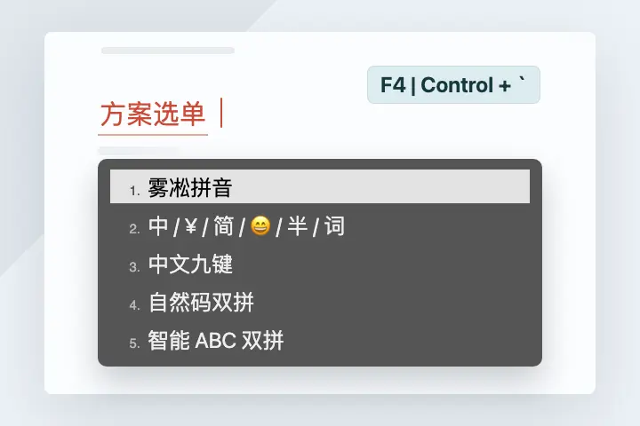 | 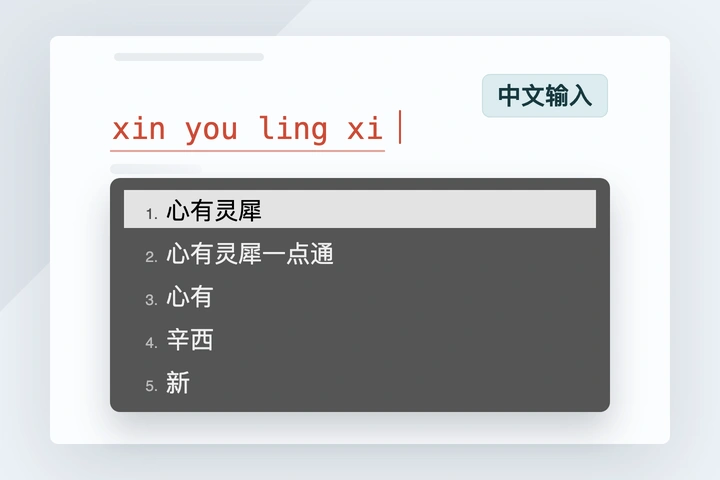 |

| **3. 英文输入** | **4. 中英混合输入** |
| -------- | -------- |
| 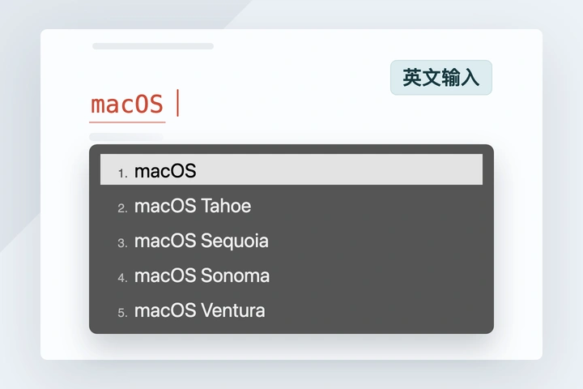 | 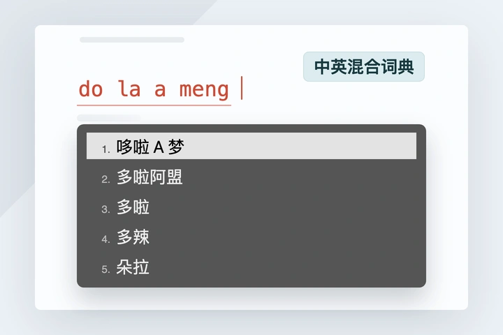 |

| **5. Emoji** | **6. 模糊音** |
| -------- | -------- |
| 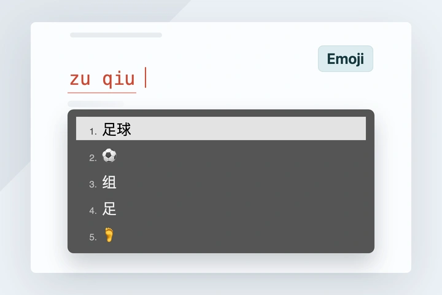 | 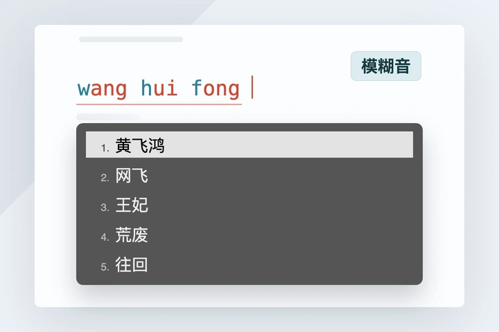 |

| **7. 自动纠错** | **8. 繁简转换** |
| -------- | -------- |
| 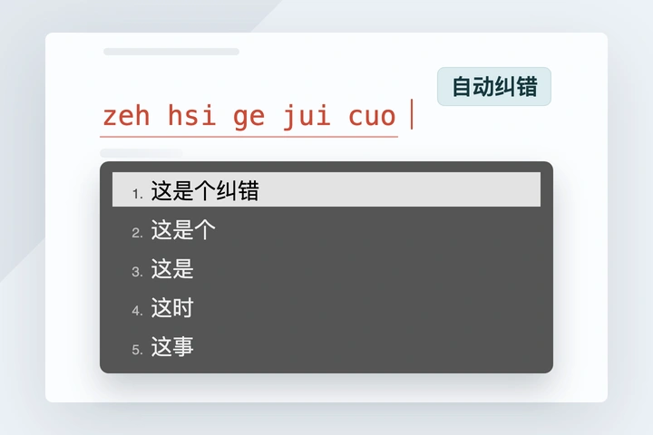 | 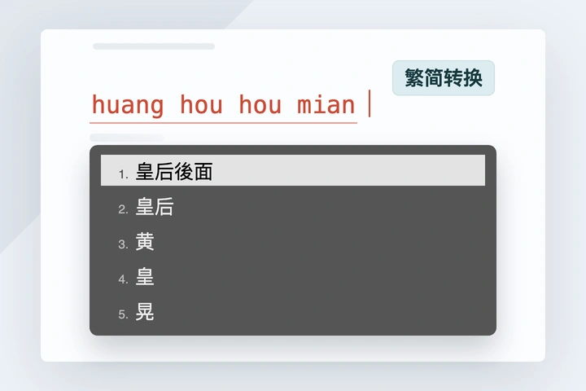 |

 

<h4 align="center"><strong>—— 🔍 反查和符号 🔍 ——</strong></h4>

| **1. 拆字反查** | **2. 数字符号转写** |
| ---- | ---- |
| 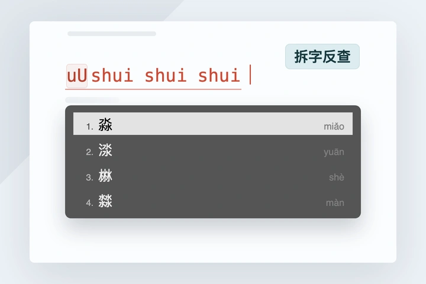 | 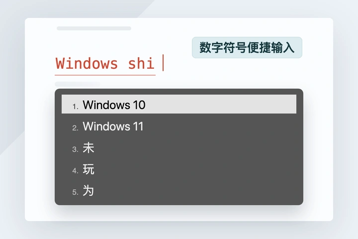 |
| 碰到生僻字，输入 <kbd>uU</kbd> + 字的部件拼音，得到汉字和注音 | 用拼音、英文输入短语中的数字和符号 |

| **3. 符号输入** | **4. 词汇别名** |
| ---- | ---- |
| 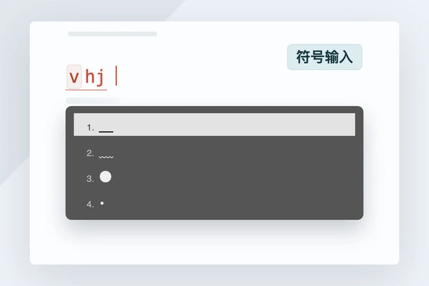 | 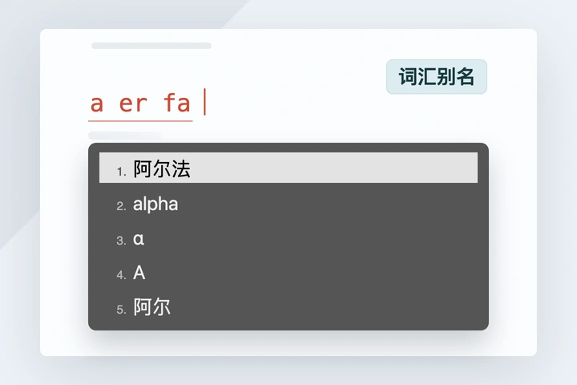 |
| 全拼 <kbd>v</kbd> + 拼音首字母；双拼 <kbd>V</kbd> + 拼音首字母 | 部分常用词，自动展示其翻译、别名、化学式、简称等 |

 

<h4 align="center"><strong>—— ✨ 扩展功能 ✨ ——</strong></h4>

| **1. 以词定字** | **2. 辅码检字** |
| ---- | ---- |
| 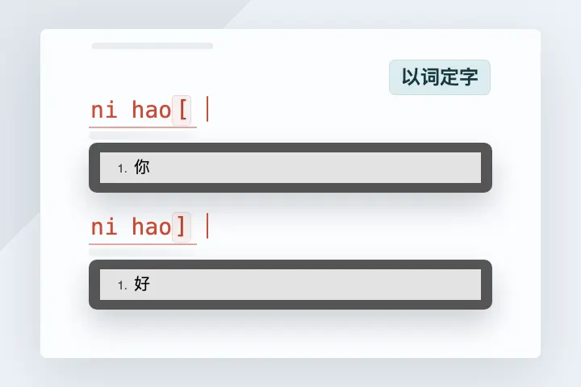 | 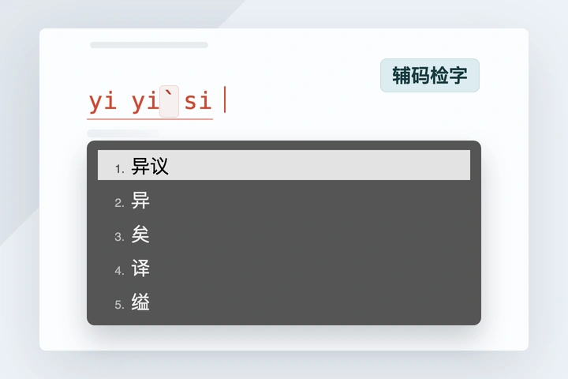 |
| 用左右中括号键，输入候选的开头或末尾的字 | 输入拼音后，再输入 <kbd>`</kbd> + 字的偏旁部首拼音，筛选候选 |

| **3. 错字错音提示** | **4. 英文自动大小写** |
| -------- | -------- |
| 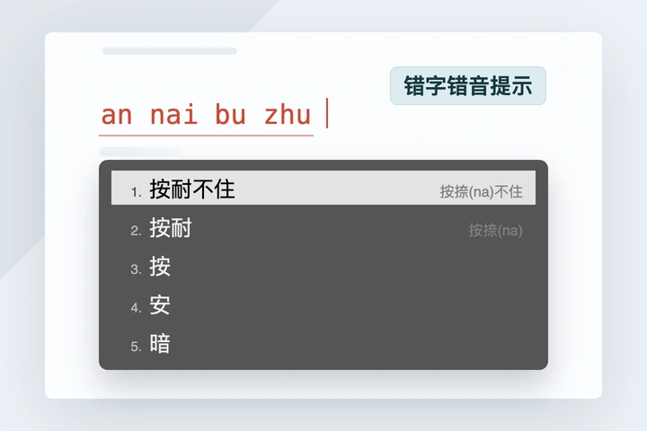 | 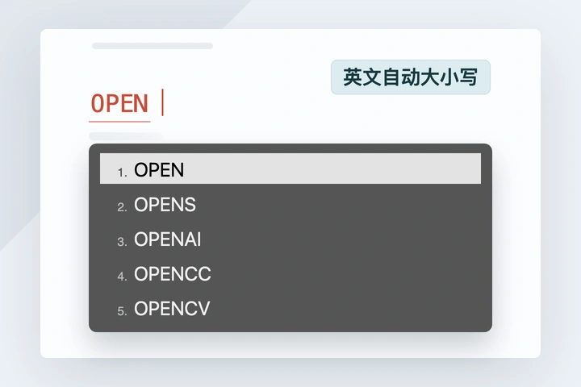 |
| 输了错字错音，雾凇会提示正确的音形 | 大写开头，得到首字母大写的单词；多个大写字母开头，得到全大写的单词 |

| **5. 日期输入** | **6. 农历输入** |
| -------- | -------- |
| 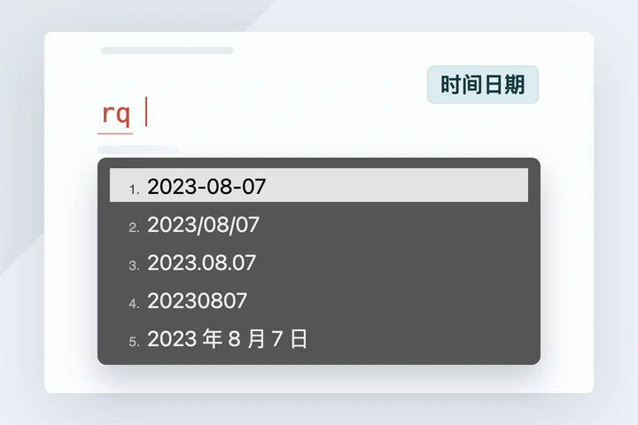 | 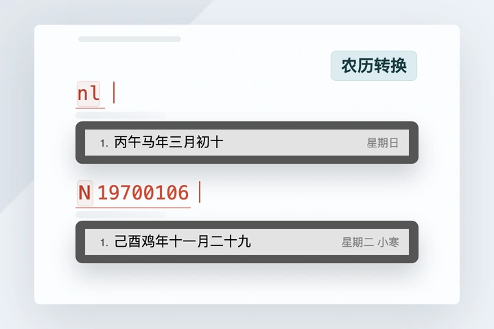 |
| 全拼输 <kbd>rq</kbd>，双拼输 <kbd>date</kbd>，得到各种格式的当前日期和时间 | 全拼输 <kbd>nl</kbd>，双拼输 <kbd>lunar</kbd>，获取当前农历；输入 <kbd>N</kbd> + 日期，获取指定日期农历和节气 |

 

<h4 align="center"><strong>—— 🧰 便捷工具 🧰 ——</strong></h4>

| **1. 计算器** | **2. Unicode 输入** |
| ---- | ---- |
| 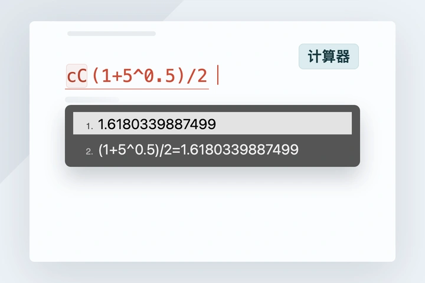 | 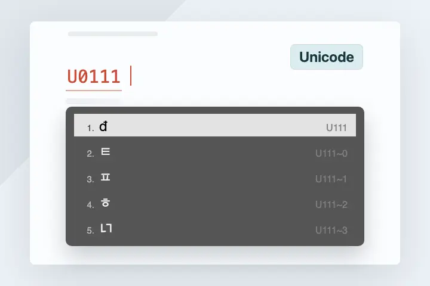 |
| 输入 <kbd>cC</kbd> 后加上算式，得到计算结果 | 输入 <kbd>U</kbd> + Unicode 编码，得到对应字符 |

| **3. UUID 生成** | **4. 数字货币转写** |
| ---- | ---- |
| 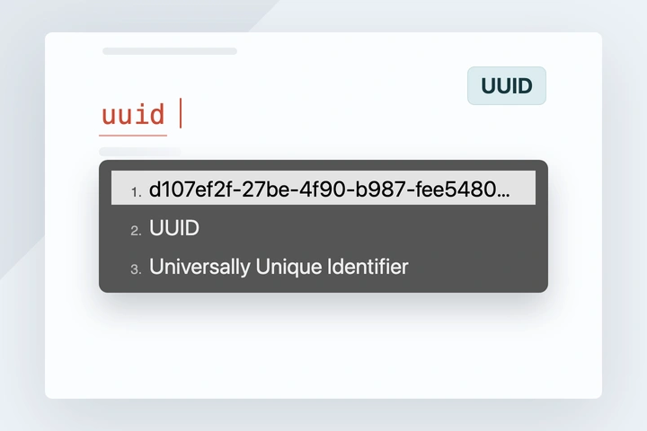 | 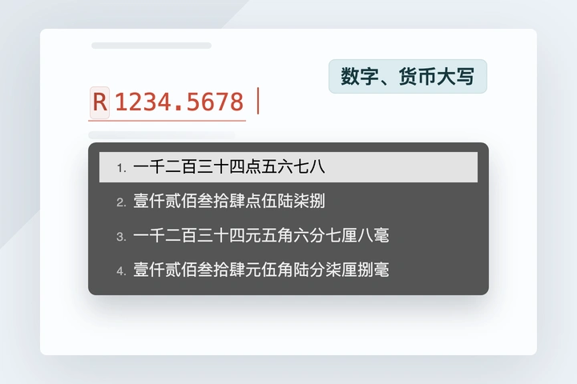 |
| 输入 <kbd>uuid</kbd>，得到一个随机生成的 UUID | 输入 <kbd>R</kbd> + 数字，自动转写为数字大写或者人民币大写 |